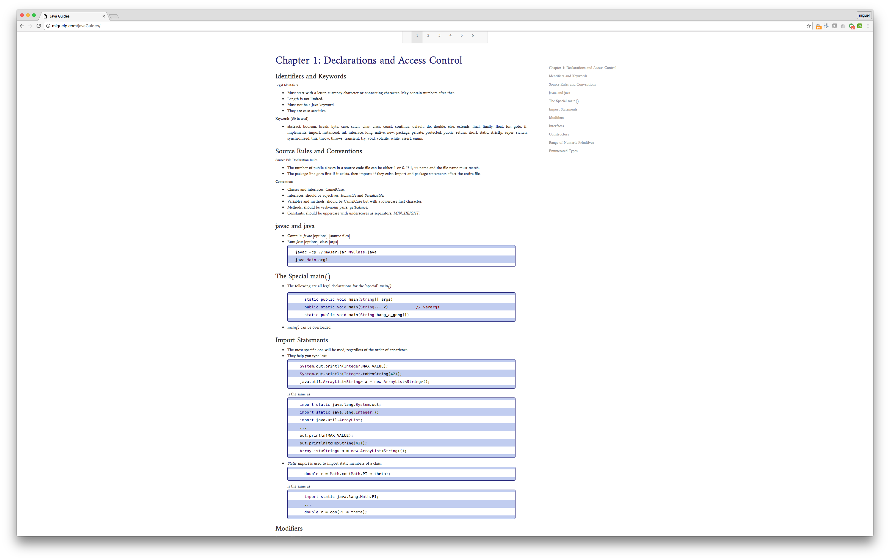

# Java 1Z0-803 Guides

Click here to: ***[ONLINE DEMO](http://miguelp.com/javaGuides)***.

### To Do:
- make menus dynamic
- be able to share links (include the current chapter in the section name)
- Chap 7 is at 90%
- Chap 8 is at 85%
- Chap 9 is at 5%
- Chap 10 is at 90%
- Chap 11 is at 0%
- Chap 12 is at 90%
- Chap 13 is at 0%
- Chap 14 is at 0%
- Chap 15 is at 0%

### Credits

The markdown files of this project were inspired by Kathy Sierra's and Bert Bates' book "OCA/OCP Java SE 7 Programmer I & II Study Guide".
Credit also goes to the following source code libraries:

- [google-code-prettify](https://github.com/google/code-prettify) - Used to present pretty code.
- [marked](https://github.com/chjj/) - Copyright (c) 2011-2014, Christopher Jeffrey.